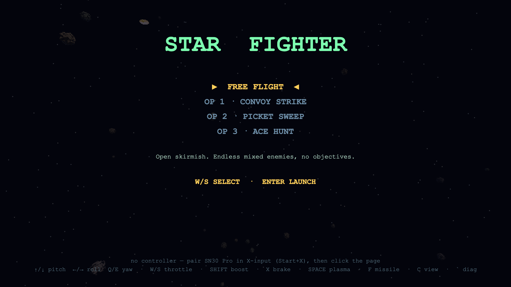
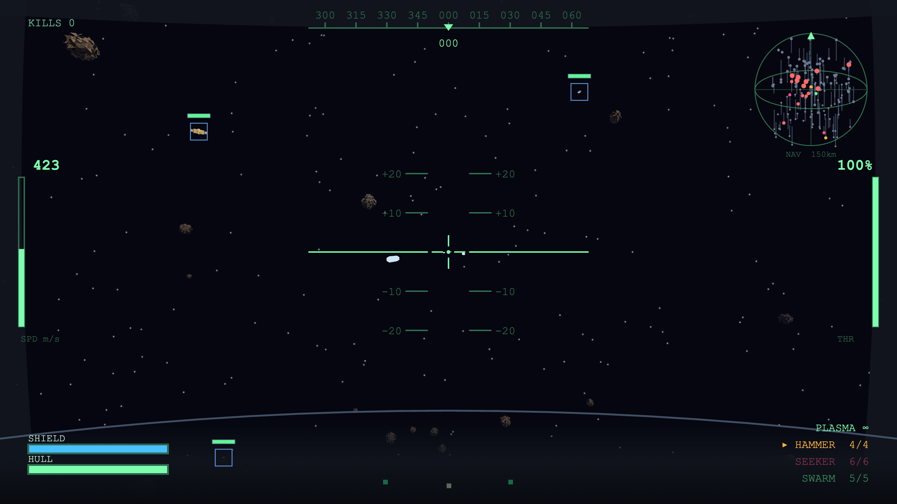
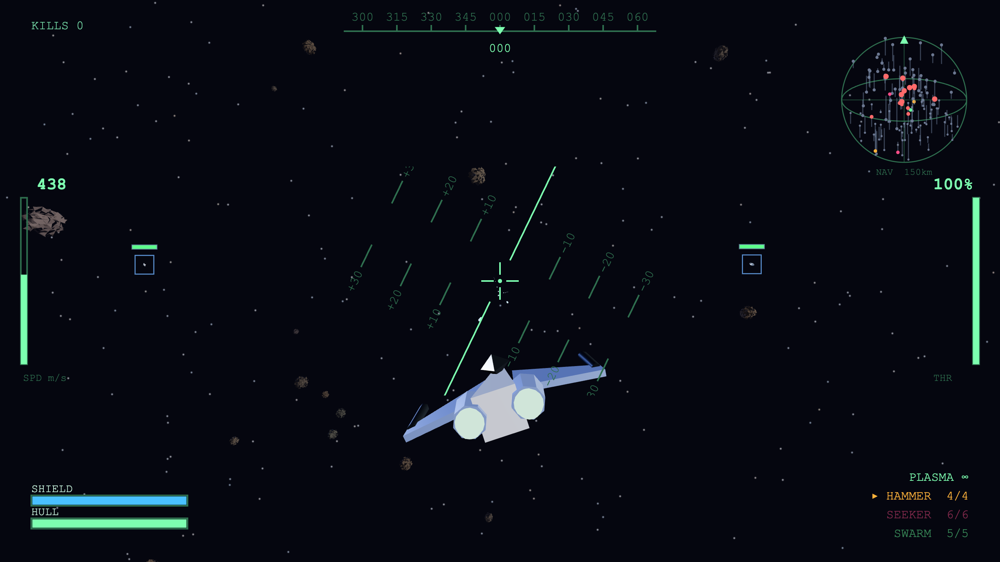
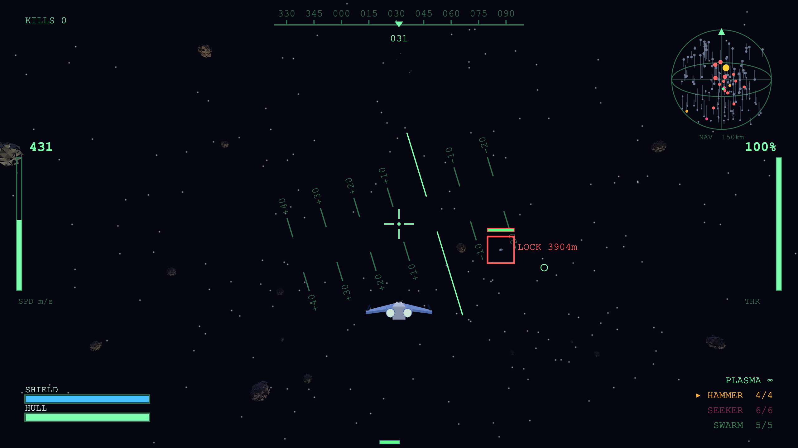

# Star Fighter

A 3D cockpit space-fighter in the spirit of X-Wing / Star Fox. WebGL (Three.js)
styled down to a 16/32-bit look, with a flight-sim-flavored arcade-hybrid flight
model and a 3D nav bubble. Built iteratively.

**▶ Play it in your browser:** https://mj00714.github.io/star-fighter/

## Screenshots

| | |
|---|---|
|  |  |
| *Mission select — free flight + three launch ops* | *Cockpit view — HUD, pitch ladder, nav bubble* |
|  |  |
| *Chase view — banking through the asteroid field* | *Far chase — target lock at 3.9 km* |

## Run it

Just open `index.html` in a browser — Three.js is vendored locally and the game
loads no external assets, so it runs offline by double-clicking.

If a browser ever blocks local files, serve the folder instead:

```
cd star-fighter
python3 -m http.server 8000
# then visit http://localhost:8000
```

**Controller:** pair the 8BitDo SN30 Pro in **X-input mode** (hold `Start + X`
when powering on), then **click the page once** so the browser exposes the pad.
Keyboard works with no controller attached.

## Controls

### SN30 Pro (X-input)
Two stick schemes — swap live with **Select** (open diagnostic) then **L3** /
`M`, or set `SF.BIND.scheme` in `config.js`:
- **twinstick** (default): left = pitch/yaw (point the nose), right = roll/look ("spin")
- **classic**: left = pitch/roll, right = yaw/look (real flight-stick feel)

| Input | Action |
|---|---|
| Left stick | Pitch (Y) + Yaw (X)  *(twinstick)* |
| Right stick | Roll (X) + Look (Y)  *(twinstick)* |
| R2 / L2 | Throttle up / down (incremental) |
| A | Boost · **B** Air-brake |
| R1 | Fire plasma (hold) |
| L1 | Fire selected missile |
| X / Y | Select HAMMER / SEEKER |
| D-pad ←/→ | Cycle missile |
| Select | Cycle view: cockpit → chase → far chase |
| Start | Pause · **R3** Diagnostic overlay |

### Keyboard fallback
`↑/↓` pitch · `←/→` roll · `Q/E` yaw · `W/S` throttle · `Shift` boost ·
`X` air-brake · `Space` plasma · `F` missile · `1/2` HAMMER/SEEKER ·
`Tab` cycle · `C` cycle view · `Enter` pause · `` ` `` diagnostic ·
`M` swap stick scheme.

## What's in iteration 1
- 6-DOF arcade-hybrid flight (rate control + nose-chasing velocity).
- First-person cockpit: canopy frame + HUD (artificial horizon & pitch ladder,
  heading strip, airspeed, throttle %, shields/hull, weapons/ammo, target lock
  with plasma lead pip).
- 3D nav bubble: bearing on the disc, elevation on the stalk.
- Arena: starfield, lumpy flat-shaded asteroids (with collision), drifting target
  drones that respawn.
- Weapons: plasma blaster + HAMMER (dumbfire) + SEEKER (homing) missiles.

## Tuning knobs (`src/config.js`)
- `flight.flightAssist` — **the feel knob.** `1` = locked-to-nose arcade,
  toward `0` = momentum/drift (Newtonian). Default `0.90`.
- `flight.pitchRate` / `yawRate` / `rollRate` / `rotDamp` — turn rates & snappiness.
- `flight.invertPitch` — flip if stick-up/nose-up feels wrong.
- `flight.maxSpeed`, `boostMult`, `throttleRate` — speed envelope.
- `display.renderScale` — lower = chunkier pixels.

## File layout
```
index.html        stage + script loading
lib/three.min.js  vendored engine (r149)
src/config.js     tunables + SN30 Pro control map
src/input.js      gamepad + keyboard → unified command
src/flight.js     ship + arcade-hybrid physics
src/weapons.js    plasma, 2 missiles, FX, targeting lock
src/world.js      arena: stars, asteroids, drones
src/cockpit.js    canopy + HUD overlay
src/navmap.js     3D nav bubble
src/missions.js   objective mission framework + mission list
src/game.js       bootstrap, loop, camera, collisions
```

## Iteration log
- **v1** — flight/gameplay module: flight model, cockpit/HUD, nav bubble, arena,
  base weapon suite (plasma + 2 missiles), SN30 Pro mapping.
- **v1.1** — controller diagnostic overlay; twin-stick scheme (now default) +
  live classic⇄twinstick swap; yaw rate bumped for twin-stick turning.
- **v1.2** — inverted pitch (pull = climb); fixed weapon readout draw-order;
  Tier-1 graphics: supersampled + AA, ACES tone-mapping, PBR materials,
  procedural rock textures, metallic drones, sun glow, additive plasma/star glow.
  (`display.renderScale` 0.5→2.0; set back to 0.5 for the chunky retro look.)
- **v2** — enemy AI: drones detect / pursue / circle-strafe / evade and fire
  with lead (`src/ai.js`); enemy bolts damage the ship; on-screen enemy health
  bars. Tunables in `CFG.ai`.
- **v2.1** — missiles hit much harder (HAMMER 24 / SEEKER 18, bigger blast);
  plasma cannons alternate L/R at the same overall rate of fire; plasma fire-mode
  toggle (AUTO / BURST-3 / BURST-5) on D-pad ▲ or `B`, shown on the HUD.
- **v2.2** — plasma velocity ×1.5 (1725); larger combat zone (boundary 5200,
  80 asteroids, 12 drones), nav bubble scans the whole arena; light procedural
  sound (`src/sound.js`): plasma, missile, explosions, hit — `N` mutes.
- **v2.3** — procedural menu music (Am·F·Dm·E loop) on the intro & pause screens,
  fades out in combat; shares the audio bus so `N` mutes it too.
- **v2.4** — beefed up SFX low end: dedicated SFX bus with a low-shelf boost plus
  layered sub-bass thumps on plasma / missile / explosions / hits.
- **v2.5** — SEEKER missiles actually hit: intercept (lead) guidance, higher turn
  rate (5.0) at a capped speed for tighter arcs, wider proximity fuse, and
  re-acquire to the nearest drone if the lock is lost.
- **v2.6** — controller rumble (dual-rumble haptics) on plasma / missile fire,
  taking a hit, and destruction; feature-detected (silent no-op if unsupported).
  Diagnostic overlay shows RUMBLE supported/none.
- **v2.6.1** — fix input lag from rumble: per-bolt plasma rumble (≈14×/sec)
  saturated the Bluetooth link that also carries input, so plasma now pulses once
  on opening fire instead. Added `V` to toggle rumble off entirely.
- **v2.6.2** — wired (USB-C) play: restored per-bolt plasma rumble and turned all
  haptics up (plasma, missile, hit, destruction). `V` still toggles it off.
  Note: dial back if returning to Bluetooth.
- **v3** — enemy-type system: each type has its own stats + mesh in
  `CFG.enemies`, spawned via `CFG.world.population` ([type, count] list). Added the
  GUNSHIP (slow, armored, 3-round volleys, hits hard) and turned drones off for
  now. AI drives all types generically. HUD counter renamed KILLS.
- **v3.1** — boost engine sound: sustained roar that spools up/down with the boost
  (A / Shift), with an engage whoosh; shares the SFX bus, `N` mutes it.
- **v3.2** — reworked boost into a tonal, harmonic "electric" swell (BMW
  IconicSounds vibe): chord stack (fundamental/5th/8ve/shimmer) that glides up in
  pitch & brightness with speed, LFO shimmer, airy ignition. No more fan noise.
- **v3.3** — shields no longer regenerate while boosting (escape vs. recover
  tradeoff); HUD shield bar turns amber + "NO REGEN" while boosting.
- **v3.4** — control remap: throttle → D-pad ▲▼, plasma → R2, missile → L2 *and* Y,
  weapon select → L1/R1 (cycles HAMMER/SEEKER/SWARM), brake → X (B free). Removed plasma
  burst modes (full-auto only). Added SWARM missile: a 6-shot homing salvo that
  spreads across nearest targets (`CFG.weapons.m3`). Multi-button bindings now
  supported (edge index can be an array). SN30 Pro face labels are Nintendo-style:
  printed Y = index 2, printed X = index 3 (missile on Y, brake on X).
- **v3.5** — mixed enemy population: 3 gunships (anchors) + 6 drones (harassers),
  via `CFG.world.population`. Lets the SWARM split targets and exercises the
  slow-tank vs. nimble contrast.
- **v3.6** — combat zone ~3x larger (boundary 15000, field 12000, 130 asteroids,
  lighter fog). Star shell, sun, and camera far-plane now scale off the boundary
  so resizing stays coherent.
- **v3.7** — target cycling on D-pad ◀▶ (`[`/`]` keyboard); lock is now sticky
  (held until target dies/leaves range, then auto-reacquires); lock range
  extended 2400 → 4800 to pick up enemies farther out.
- **v3.8** — headphone/spatial audio: world events (enemy deaths, missile blasts)
  play through HRTF binaural panners positioned in 3D; new directional enemy-fire
  cue; menu music stereo-widened. Own-ship sounds stay centered.
- **v3.9** — new enemy: INTERCEPTOR (fast, fragile, aggressive close-range
  double-tapper; cyan bolts, dart silhouette). Population isolated to 6
  interceptors for testing (drones/gunships off).
- **v3.10** — missile economy: carry caps (HAMMER 4 / SEEKER 6 / SWARM 5; `ammo`
  field = cap), HUD shows current/max. Resupply rings (`CFG.world.pickups`) scatter
  the zone — fly through to rearm all missiles to cap (only consumed if needed),
  respawn after 6s, shown green on the nav bubble. Chime on pickup.
- **v3.11** — HAMMER buffed (dmg 24 → 60, blast 130 → 175) to match its scarcity:
  one-shots a gunship and clears a cluster around the hit.
- **v3.12** — resupply rings are now type-specific: each refills ONE missile type,
  color-matched to it (HAMMER amber / SEEKER pink / SWARM green). Rings spawn one
  per type (round-robin), respawn same type, nav blips use the ring color, and the
  HUD weapon list is color-coded to match.
- **v4** — mixed encounter: 3 gunships + 5 interceptors + 6 drones together
  (`CFG.world.population`). Each role respawns as its own type, keeping the mix.
- **v4.1** — crisp rendering: both canvases now match the stage's true on-screen
  pixels (CSS scale × devicePixelRatio), recomputed on resize (debounced). HUD
  text is pixel-perfect; `renderScale` is now supersampling relative to native
  (1.0 default; <1 for the chunky retro look); new `maxPixelScale` perf cap.
- **v5** — objective missions (`src/missions.js`): mission select on the start
  screen (D-pad ▲▼ / W-S, START/ENTER to launch), objective HUD panel, cyan
  waypoint markers (world + nav bubble), success/fail states, debrief screen
  with kills/time, X aborts from pause. Enemy respawn is suppressed during
  missions (free flight unchanged). Three launch ops: CONVOY STRIKE (kill 3
  convoy gunships, escorts optional), PICKET SWEEP (fly 3 waypoints, clear an
  escalating ambush at each), ACE HUNT (one 9×-HP fast ace + 4 escorts).
- **v5.1** — waypoints are now big square gates (~4× the resupply rings, nested
  diamond + glow) so they never read like a depot; ace scaled to 3.2× with HP
  raised to 16× to keep time-to-kill boss-like against the bigger hitbox.
- **v5.2** — external views: SELECT / `C` cycles cockpit → chase → far chase
  (offsets in `CFG.camera`). Added a player fighter mesh (green-trim dart,
  twin engine glows), visible only in external views. Canopy frame hides
  outside the cockpit; HUD instruments stay. Diagnostic moved to R3.
- **v5.3** — player fighter redesigned (Arwing-flavored): white pyramid fuselage,
  canopy bubble, swept blue delta wings with anhedral, wingtip cannons, twin
  engine glows. Plasma ports moved to the wingtip cannons (±24, was ±9) so bolts
  visibly leave the barrels in chase views, with X-wing-style convergence on the
  sight line (`plasma.converge`, 600) so centered aim still hits.
- **v5.4** — chase-cam lag: in external views the camera's orientation slerps
  toward the ship's (`CFG.camera.lag`, 6/s) instead of hard-locking, and the
  camera offset rides the lagged frame — rolls/yaws/pitches visibly bank the
  ship in-frame before the camera catches up (Star Fox / Rogue Squadron feel).
  Cockpit view stays rigid; the lagged frame resyncs there for clean cuts.
- _Next candidates_ — more mission types (defend/escort — needs AI targets other
  than the player), mission scoring/medals, more weapons, controller remap UI,
  cockpit damage reactions, in-game flight-assist toggle, bloom (Tier-2, needs
  module setup).
